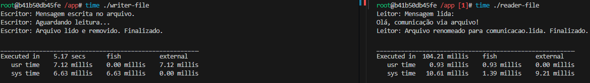
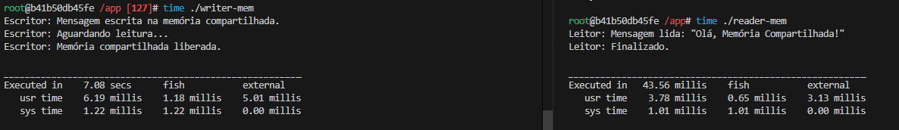
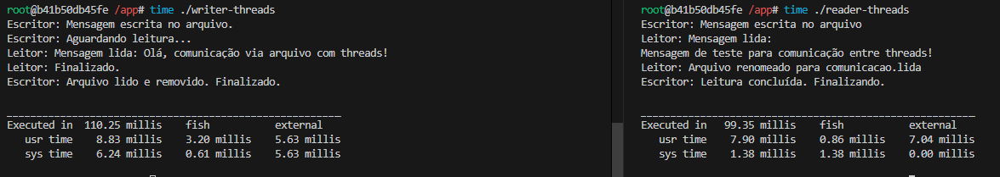
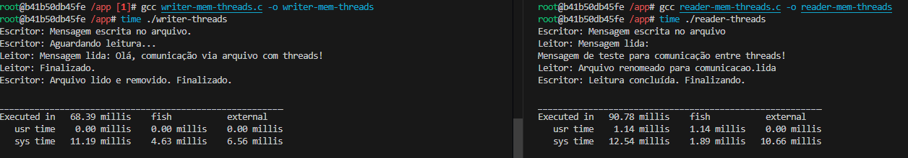

# S.O. 2025.1 - Atividade 05

Discente: Bernardo de Moura Medeiros
Data: 09/06/2025

---

## 1. Objetivo

Execução de código C dentro do container Docker criando um ambiente isolado de desenvolvimento capaz de compilar e executar programas nas linguagens C.

## 2. Preparando ambiente

### Criando Imagem através do Dockerfile

Executei um Dockerfile criado com base nas informações da proposta da atividade. Contendo configurações necessárias para gerar uma imagem baseada na distro Fedora, incluindo o compilador para códigos C. Assim, baixei a imagem base do Fedora e fiz a instalação de todos os pacotes solicitados no Dockerfile.

### Execução do Container


A partir da execução da imagem, o terminal fish foi inicializado, indicando que o ambiente isolado foi criado com sucesso.

## 3. Compilação e execução de códigos

Uma vez que entrei no shell fish, compilei e executei os códigos C conforme citados no readme e os que formulei utilizando threads. Conferi o tempo de execução do programa utilizando o comando **time**

```bash
time ./threads
```

### Saída e tempo de execução do writer e reader

<div>
    
</div>

### Saída e tempo de execução do writer e reader com memória compartilhada

<div>
    
</div>

### Saída e tempo de execução do writer e reader utilizando threads

<div>
    
</div>

### Saída e tempo de execução do writer e reader com memória compartilhada utilizando threads

<div>
    
</div>

## 4. Conclusão
A prática foi extremamente útil .
